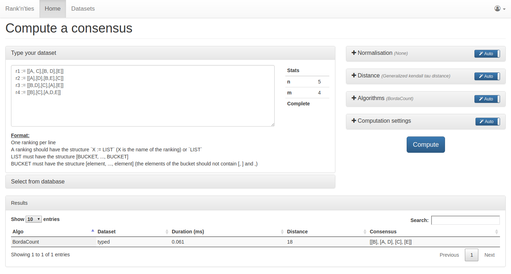
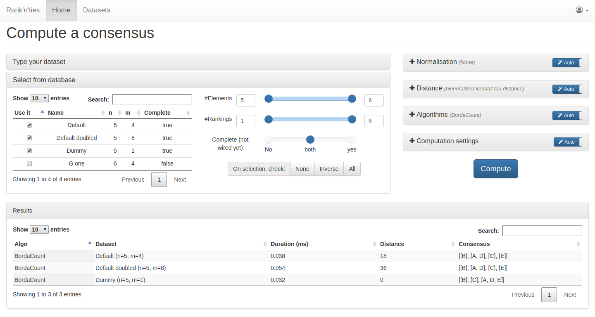

# rank-aggregation-with-ties




### How to start with with virtualenv

```shell
cd sources/
setup_venv.sh
cd rnt/
python manage runserver 0.0.0.0:8030
# (...)
# Once CTRL+C pressed
deactivate
```

### How to start with docker

```shell
cd sources/rnt/
# to initialize the database password and dev cert.
./resources/setup.sh
# to start the framework, see the logs directly and be able to stop it with CTRL+C
docker-compose up --build
# to start the framework in deamon mode
docker-compose up --build -d
# to stop the framework
docker-compose down
```

